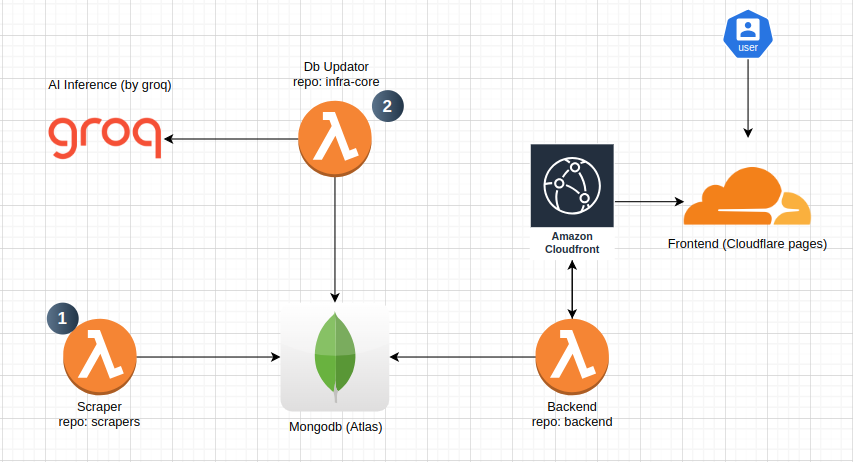

# 🛠️ Dhoondlai - PC Parts Scraper

Dhoondlai is an open-source project aimed at helping users find the best prices for PC parts across various vendors in Pakistan. This project scrapes data from multiple websites and displays it in one central location, making it easier for consumers to compare prices and make informed decisions.

Currently the aim is to list processors.

## 🚀 Features

- **Comprehensive Scraping**: Scrapes data from multiple vendors in Pakistan to gather the latest prices and product availability.
- **Python-Powered**: Uses Python's BeautifulSoup, Requests, and Selenium for robust and efficient scraping.
- **Serverless Deployment**: Scrapers are implemented as AWS Lambda functions, deployed using the Serverless Framework.
- **Infrastructure as Code**: All related infrastructure is managed through Terraform, ensuring consistency and scalability.

## 🏗️ Project Structure

- **scrapers**: Contains all the scraper functions.
- **infra-core**: Manages the infrastructure using Terraform.
- **backend**: Contains the backend code for the API.
- **frontend**: Contains the frontend code for the web application.

## High level infrastructure

## 🛒 Current Vendors

| Vendor          | Status         | Processors | Motherboards | RAMs | Graphics Card | SSD |
| --------------- | -------------- | ---------- | ------------ | ---- | ------------- | --- |
| Techmatched     | 🟠 In Progress | ✔️         | ❎           | ❎   | ❎            | ❎  |
| JunaidTech      | 🟠 In Progress | ✔️         | ❎           | ❎   | ❎            | ❎  |
| BuyersPk        | 🟠 In Progress | ✔️         | ❎           | ❎   | ❎            | ❎  |
| RB Tech N Games | 🟠 In Progress | ✔️         | ❎           | ❎   | ❎            | ❎  |

_More vendors coming soon!_

## 🌍 Contributing

We welcome contributions from developers around the world! If you're interested in adding more vendors, improving the scrapers, or enhancing the infrastructure, feel free to contribute.

### How to Contribute

1. **Fork the Repository**: Start by forking the repository to your GitHub account.
2. **Clone the Repo**: Clone your forked repository to your local machine.
3. **Make Your Changes**: Work on your changes in a new branch.
4. **Submit a Pull Request**: Once you're happy with your changes, submit a pull request for review.

If you have any questions or need guidance, feel free to reach out via email: [khan.hadi2951@gmail.com](mailto:khan.hadi2951@gmail.com).

## 📜 Disclaimer

All rights to the products and data scraped belong to their respective vendors. We do not take any ownership of the content; Dhoondlai simply aggregates the data for user convenience. We only link to the vendor sites and do not sell any products directly.
